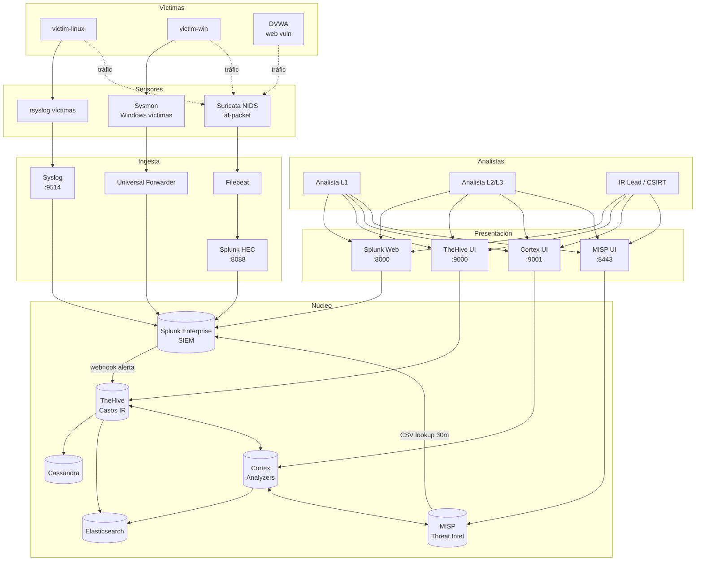
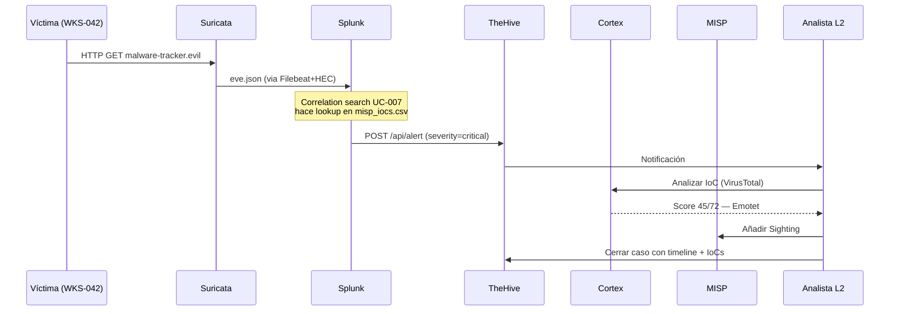
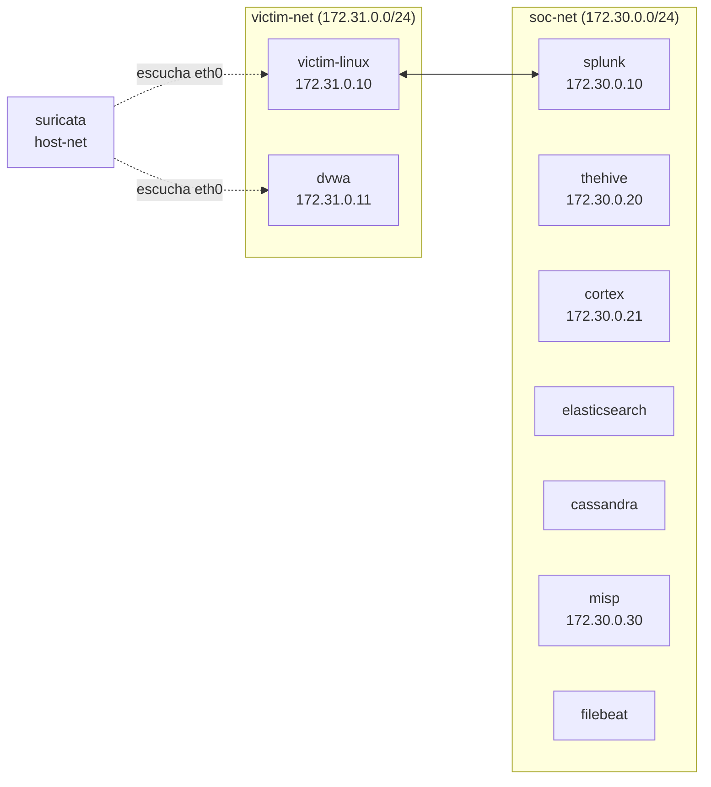

# Arquitectura del SOC Lab

## Vista lógica

## Vista de flujo de una alerta

## Vista de red

## Puertos expuestos al host

| Servicio | Puerto host | Protocolo |
|----------|-------------|-----------|
| Splunk Web | 8000 | HTTP |
| Splunk HEC | 8088 | HTTP |
| Splunk API | 8089 | HTTPS |
| Splunk Fwd | 9997 | TCP |
| TheHive | 9000 | HTTP |
| Cortex | 9001 | HTTP |
| MISP | 8443 | HTTPS |
| DVWA | 8080 | HTTP |

## Volúmenes persistentes

- `splunk-var`, `splunk-etc` — índices, configs
- `cassandra-data`, `elasticsearch-data` — TheHive backend
- `thehive-data`, `cortex-data` — attachments, jobs
- `misp-db`, `misp-files` — DB y evidencias
- `suricata-logs` — eve.json, fast.log
