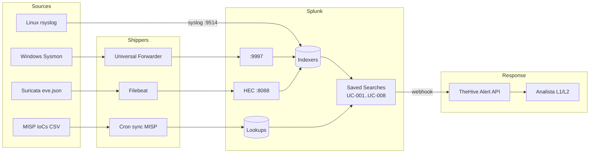

# Flujo de datos — Ingesta y correlación

## Volumen esperado (baseline lab)

| Fuente | EPS típico | Volumen diario |
|--------|-----------|-----------------|
| Suricata | 5-50 | 50-500 MB |
| linux:auth | < 1 | ~5 MB |
| Sysmon | 20-200 | 200 MB - 2 GB |
| MISP lookup | 0 (batch) | 1-5 MB |

Total esperado: **~2 GB/día** (dentro del límite de Splunk Free de 500 MB/día NO, requiere Trial de 60 días o licencia comercial).

## Retención

| Índice | Hot | Cold | Frozen |
|--------|-----|------|--------|
| soc_suricata | 7d | 30d | delete |
| soc_endpoints | 30d | 90d | delete |
| soc_windows | 30d | 90d | delete |
| soc_threatintel | 90d | 365d | delete |
